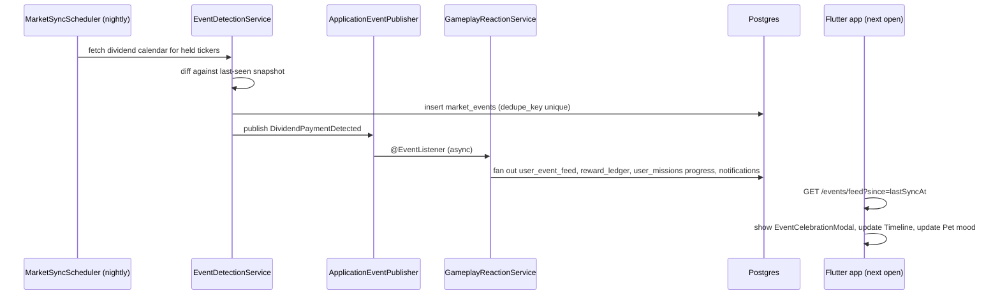
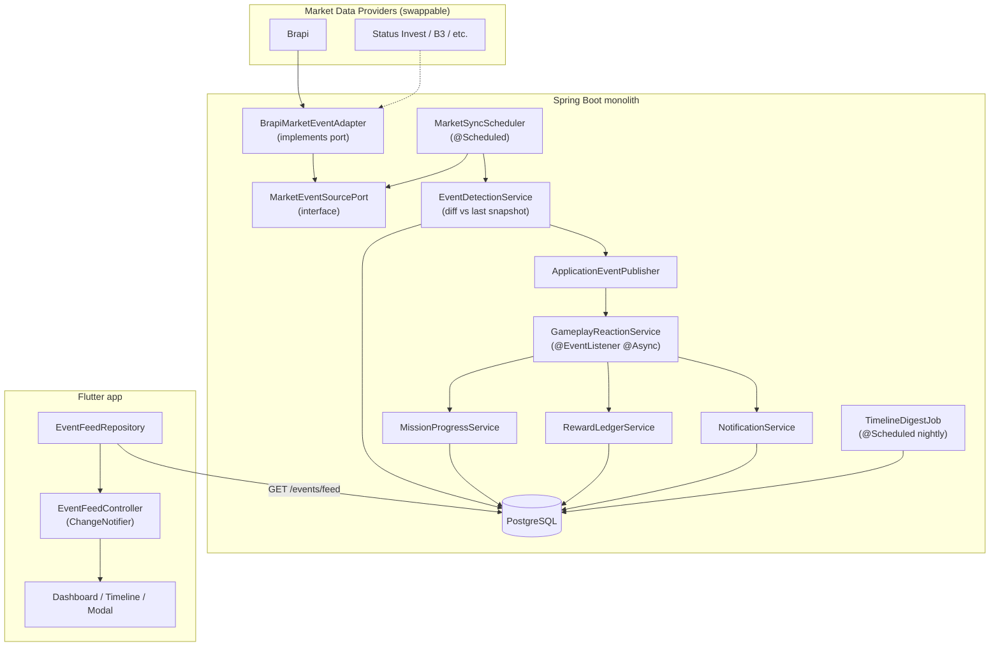
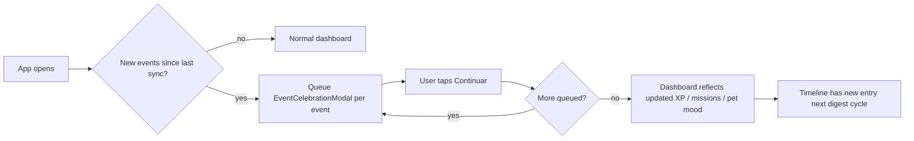
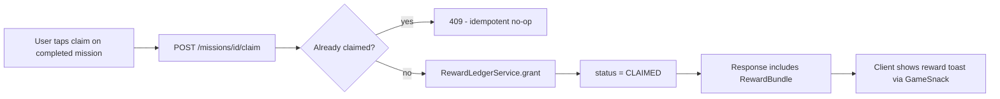

# MARKET_EVENTS_ENGINE.md

# Market Events & Gamification Engine

## Status

Design specification. Not yet implemented.

This document is the blueprint for turning real market data into gameplay. It is written to the quality bar of a
production system, but it is deliberately **phased** — see [Reconciling Ambition With the Roadmap](#reconciling-ambition-with-the-roadmap)
before building anything from it.

---

## Reconciling Ambition With the Roadmap

Three existing documents constrain this feature and were read before writing a single line of this spec:

- **ROADMAP.md** lists "Market events" under *Future Features*, explicitly excluded from the MVP, and instructs:
  "Avoid speculative development."
- **AI_RULES.md** forbids introducing event sourcing, CQRS, microservices, or serverless architecture "unless there
  is a clear reason," and says new systems should not delay MVP delivery.
- **DECISIONS.md** (DECISION-003) accepts scheduled jobs and async workloads as the *only* sanctioned form of
  background processing for now — no message brokers, no service split.

The brief asks for a system built for "millions of users," modeled on Supercell/Riot/Duolingo. That is the right
target for the *idea*, not for the *first commit*. A senior engineer's job here is not to refuse the ambition — it's
to sequence it so today's version is honest about what data actually exists and doesn't outrun a pre-launch MVP.

So this document does two things at once:

1. Designs the **full system** the brief asked for — every one of the 20 deliverables — as the north-star
   architecture, explicitly slotted into **ROADMAP Phase 3 (Growth)**, where "Notifications" and "Seasonal events"
   already live.
2. Calls out, inline, a **Phase 0 slice** that is small enough to ship inside the current MVP without violating any
   of the three documents above — because most of "Market Events" is really just *renaming and re-presenting* work
   the app already does (see below), not a new system.

### What already exists

Before designing anything new, here's what's already in the codebase and should be extended, not replaced:

| Concern | Already exists at |
|---|---|
| Rule-based mission list, evaluated live against portfolio state | [`mission_catalog.dart`](../petapp_mobile/lib/features/portfolio/domain/services/mission_catalog.dart) |
| Permanent achievement catalog + local unlock persistence | [`achievement_catalog.dart`](../petapp_mobile/lib/features/portfolio/domain/services/achievement_catalog.dart), [`achievements_local_repository.dart`](../petapp_mobile/lib/features/portfolio/data/repositories/achievements_local_repository.dart) |
| Rule-based "read the data, don't fabricate insight" text generator | [`insight_generator.dart`](../petapp_mobile/lib/features/portfolio/domain/services/insight_generator.dart) |
| Reward celebration UI moment | [`achievement_celebration_overlay.dart`](../petapp_mobile/lib/features/portfolio/presentation/widgets/achievement_celebration_overlay.dart) |
| Pet mood/animation state machine | [`pet_animation_state.dart`](../petapp_mobile/lib/features/pet/domain/enums/pet_animation_state.dart), `MascotController` |
| External market data port (quote + search only, data-source agnostic already) | [`ExternalInvestmentApiPort.java`](../PetApp-Backend/src/main/java/com/jf/PetApp/application/investment/port/ExternalInvestmentApiPort.java) |
| Notification preference toggles in Settings UI (not yet wired to a backend) | `AppStrings.dailyMissionReminders`, `AppStrings.achievementAlerts` |

This spec is the design for turning that already-working, client-computed gamification layer into a **real,
server-authoritative, event-driven system** — not a rewrite of it.

### The honest data gap

**Update:** `BrapiInvestmentApiClient.getDividends(ticker)` (added for the "Dividend Radar" feature, see
FEATURES.md) now wires Brapi's `/api/v2/stocks/dividends` endpoint — confirmed cash dividend/JCP/yield history and
announcements per ticker, no token required. This closes the data gap for the `DIVIDEND_ANNOUNCED` /
`DIVIDEND_PAYMENT_TODAY` / `ETF_DISTRIBUTION_RECEIVED` rows in Section 2's table below: the raw data source now
exists (`GetDividendRadarUseCaseImpl`, `application/investment/usecase/`), it's just not yet wired into the
event/mission/notification/XP machinery this document specifies (no `MarketEventSourcePort`, no
`market_events` table, no scheduler, no `GameplayReactionService`). Those rows should be re-read as "data source
solved, gameplay wiring still Phase 3+", not "blocked on data".

There is still no earnings release, no 52-week range, no corporate-action feed beyond dividends, and no news feed
wired anywhere in the backend. FEATURES.md itself says "Market data is simulated" for quotes.

Everything in the brief that depends on earnings/other corporate-action data (Educational Events, most Portfolio
milestone triggers) is **real-data-shaped but currently has no real data source**. This spec treats that as a
solvable integration problem (a new `MarketEventSourcePort` method set, Section 15), not a reason to fake the data.
**Never simulate a dividend payment as if it were real** — if the data source can't confirm it, the event does not
fire. This is non-negotiable per the brief itself ("Never create fake financial information") and per
DECISION-006/DECISION-007 (the app is an educational simulator, not a source of financial misinformation). The
Dividend Radar's own use case enforces this by scaling historical payments by the quantity the user actually held
at the data-com date, not their current quantity — see `GetDividendRadarUseCaseImpl.quantityHeldAsOf`.

Event categories that need **no new data source** — because they're derivable entirely from data already flowing
through `PortfolioController`/`GetPortfolioSummaryUseCase` today — are marked **[Phase 0]** throughout this document.
Everything else is marked **[Phase 3+]** and depends on a market-data provider upgrade first.

---

## 1. Feature Specification

### Vision

Investing apps show numbers. Pet Invest App turns the same numbers into a moment. The Market Events Engine is the
system that watches for anything meaningful happening to a user's real simulated portfolio or the real market
behind it, and turns that fact into a piece of gameplay — a mission update, an XP reward, a pet reaction, a
timeline entry, a notification — without ever changing what the fact *is*.

### Product pillars

1. **The number never lies.** Every reward is attached to a real, traceable event. If the market data can't be
   confirmed, no event fires, no reward is granted, no pet reaction happens.
2. **The pet is the emotional layer, not the data layer.** The pet reacts to events; it never presents raw data
   itself, and per PROJECT_CONTEXT.md it never punishes, degrades, or "dies" from bad market conditions — a market
   drop produces a calm, educational reaction, not a penalty.
3. **Every event has exactly one job**: become at least one gameplay consequence (mission progress, XP, badge
   progress, timeline entry, or notification). An event that produces nothing is a bug, not a feature waiting to be
   built.
4. **Boring by default, delightful at the moment of payoff.** The Daily Dashboard is a 10-second read; the
   celebration is the one moment allowed to be loud (this already exists — see `AchievementCelebrationOverlay`).

### Before / after (the brief's own example, applied to this app's voice)

Before:

> PETR4 vai pagar dividendos.

After (an `EventCelebrationModal`, Section 4):

```
🎁 Dia de Dividendo!

Parabéns, Comandante!

PETR4 vai pagar:
R$ 58,30

Data de pagamento:
15 de agosto

+20 XP
+Felicidade do Pet
Missão "Caçador de Dividendos" atualizada

[ Continuar ]
```

The number (`R$ 58,30`, `15 de agosto`) is unchanged from the source data. Only the frame changed.

### Non-goals

- No fabricated financial data, ever — see [The honest data gap](#the-honest-data-gap).
- No real-money mechanics. Rewards (XP, coins, cosmetics) never touch the user's simulated cash balance in a way
  that could be confused with real investment returns (already established by DECISION-007 / ROADMAP "Features Not
  Planned").
- No punitive pet mechanics. A falling market never produces a negative reward, a broken streak-shame message, or
  pet unhappiness framed as failure.
- No message broker, no microservice split, no event-sourced ledger as the source of truth for money-shaped
  numbers. `Investment`/`Finance` stay the system of record; events are a derived, replayable projection over them
  (Section 5 explains why this satisfies "event-driven" without violating DECISION-003).

---

## 2. Event Categories & Gameplay Mapping

Every event type maps to: a trigger condition, a gameplay consequence, a pet reaction, and a phase.

| Event | Trigger | Gameplay consequence | Pet reaction | Phase |
|---|---|---|---|---|
| `PORTFOLIO_FIRST_INVESTMENT` | First `Investment` row ever created for the user | +50 XP, unlock `first_investment` achievement, timeline entry | 🎉 "Sua jornada começou!" | **0** (already exists as `first_investment` achievement — just needs an event wrapper) |
| `PORTFOLIO_MILESTONE_VALUE` | Portfolio current value crosses 5k/10k/50k/100k thresholds | XP + badge progress, timeline entry | 🎉 "Estamos ficando mais fortes!" | **0** (thresholds already exist in `MissionCatalog`) |
| `PORTFOLIO_HOLDINGS_COUNT` | Distinct holdings count crosses 1/10/25 | XP, mission progress | 😊 encouraging line | **0** |
| `PORTFOLIO_NEW_RECORD` | Today's portfolio value > all-time high seen so far | Small XP, timeline highlight | 🎉 "Novo recorde pessoal!" | **0** (needs a persisted high-water mark, Section 6) |
| `DIVERSIFICATION_LEVEL_UP` | Distinct asset-type count increases | XP, mission progress (`diversification_master` already exists) | 😊 | **0** |
| `PASSIVE_INCOME_MILESTONE` | `PassiveIncomeEstimator` monthly estimate crosses R$100/500/1000 | XP, badge, timeline | 🎉 "Renda passiva subindo!" | **0** (estimator already exists) |
| `STREAK_MAINTAINED` | Consecutive days with an app open/action taken | Streak counter +1, occasional bonus coins | 😊 | **0** (new: `user_streak`, Section 6) |
| `GOAL_COMPLETED` | A user-set financial goal (future Goals feature) is reached | XP, badge, timeline | 🏆 "Investidores lendários!" | **3+** (depends on a Goals feature that doesn't exist yet) |
| `MARKET_OPENED` / `MARKET_CLOSED` | B3 session calendar (09:00–18:00 America/Sao_Paulo, weekdays) | Dashboard "Market Status" chip flips; no reward (informational) | none | **0** (pure calendar logic, no external data needed) |
| `PRICE_DAILY_MOVE` | A held ticker's daily change ≥ configurable threshold (e.g. ±5%) | "Review today's biggest mover" mission | 🤔 (down) / 😊 (up) | **0** (quote + change-percent already returned by `AssetQuoteResponse`) |
| `PRICE_NEW_52W_HIGH` / `_LOW` | Quote crosses the 52-week range | Educational mission ("what does a 52-week high mean?") | 🤔 / 😊 | **3+** (needs historical range data, not just spot quote) |
| `DIVIDEND_ANNOUNCED` | Provider reports a new dividend declaration for a held ticker | Mission created, notification | 😊 | **3+** (new data source) |
| `DIVIDEND_PAYMENT_TODAY` | Payment date == today for a held ticker | XP, coins, pet happiness, timeline, notification | 😊 "Você ganhou renda passiva hoje!" | **3+** |
| `EX_DIVIDEND_DATE` | Ex-date == today for a held ticker | Informational mission/notification | 😊 | **3+** |
| `ETF_DISTRIBUTION_RECEIVED` | FII/ETF monthly distribution posted | Same as dividend payment | 😊 | **3+** |
| `EARNINGS_RELEASED` | Provider reports a quarterly earnings release for a held ticker | Educational mission ("read today's earnings summary") | 🤔 curious, neutral | **3+** |
| `ETF_COMPOSITION_CHANGED` | Fund composition update | Educational mission | 🤔 | **4+** |
| `MACRO_RATE_CHANGED` / `MACRO_INFLATION_UPDATED` | Selic/CDI or IPCA update from provider | Educational mission | 🤔 | **4+** |

Every row above either already has the data it needs (Phase 0) or names exactly what new data it's blocked on
(Phase 3+/4+) — deliberately, so nothing on this list can be built by faking the missing half.

---

## 3. UX Flow

### 3.1 Daily Dashboard

`DashboardScreen._buildHomeContent()` already renders, top to bottom: `PetShowcase` → portfolio summary → wealth
chart → allocation → quick actions → `MissionsAchievementsSection`. The brief's "Today's Summary" strip slots in
between `PetShowcase` and the summary section as a new `DailySummaryStrip` widget — it does not replace anything,
and it does not add a new nav tab (DESIGN_SYSTEM.md: "Avoid deep navigation hierarchies"; the commented-out
Analytics tab in `dashboard_screen.dart` is a standing reminder that new tabs need a real reason).

```
┌─────────────────────────────────────────┐
│  Bom dia, Comandante! ☀️                  │
│                                           │
│  Portfólio        Renda Passiva          │
│  +1.8%            R$ 38                  │
│                                           │
│  Próximo Dividendo   Missões Hoje        │
│  4 dias               3                  │
│                                           │
│  Humor do Pet    Sequência               │
│  😊 Feliz         🔥 18 dias              │
│                                           │
│  Mercado: 🟢 Aberto      [Recompensa ✓]  │
└─────────────────────────────────────────┘
```

Read time target: under 10 seconds, per the brief. Every tile links to something real already on screen further
down (portfolio %, missions section) — it's a summary, not new information.

### 3.2 Event celebration moment

Reuses `AchievementCelebrationOverlay`'s exact shell (full-screen scrim, `GlassCard`, elastic scale-in, haptic,
4s auto-dismiss, "Toque para continuar") generalized into `EventCelebrationModal(event: MarketEvent)`, so a
dividend-payment celebration and an achievement celebration are visually the same *family* of moment, just
different icon/copy/color — consistent with DESIGN_SYSTEM.md's "reuse before you invent."

### 3.3 Timeline ("Jornada")

A new screen, reachable from the Profile screen (not a new bottom-nav tab — Profile already aggregates
"who the player is"), listing `TimelineEntry` cards newest-first:

```
┌─────────────────────────────────────────┐
│  Dia 132                                 │
│  Portfólio: R$ 12.000  (+1.4%)           │
│  Recebeu R$ 86 em dividendos             │
│  3 missões concluídas                    │
│  Pet evoluiu para Nível 4 ✨              │
└─────────────────────────────────────────┘
```

### 3.4 Notification inbox

A lightweight in-app inbox (bell icon in the `DashboardScreen` app bar, next to search/settings) backed by
`GET /notifications`. Push (FCM) is Phase 3+ infrastructure not yet in the app — see Section 10.

### 3.5 User flow — dividend payment, end to end



---

## 4. Technical Architecture

The brief's four "modules" (Market Data Layer, Event Detection Engine, Gameplay Engine, Notification/Timeline
Engine) map onto the backend's **existing layered style** — `Controller → Service → Repository` — as new services
inside the existing Spring Boot monolith, not new deployables. "Event-driven" here means **Spring's in-process
`ApplicationEventPublisher`** plus **`@Async`/`@Scheduled`** — the same primitive DECISION-003 already blesses for
"scheduled jobs, notification processing, ranking calculations." No Kafka, no separate services, no event store as
system of record. If usage ever proves this insufficient, Section 21 has the upgrade path — but that's a future
decision, not a default.



### Why this satisfies "event-driven" without violating AI_RULES.md

- **Domain layer**: `MarketEvent`, `EventType`, `RewardBundle` as plain records under `core/domain/event/`.
- **Repository pattern**: Spring Data JPA repositories per table (Section 6), same as `InvestmentRepository` today.
- **Services / use cases**: `EventDetectionService`, `GameplayReactionService`, `MissionProgressService`,
  `RewardLedgerService`, `NotificationService`, `TimelineDigestJob` — each single-responsibility, matching
  ARCHITECTURE.md's "each layer has a single responsibility."
- **Event bus**: `ApplicationEventPublisher` — in-process, no new infrastructure dependency.
- **Background jobs**: `@Scheduled` cron methods, already the sanctioned async mechanism.
- **Notification pipeline**: a `NotificationChannel` interface with one implementation today (`InAppChannel`,
  writes to the `notifications` table) and a `PushChannel` (FCM) added later without touching callers.
- **State management (client)**: `ChangeNotifier`, matching every existing controller — no new package.
- **Offline support / caching**: covered in Sections 9 and 11, using the same `shared_preferences`-backed local
  repository pattern as `AchievementsLocalRepository`.

---

## 5. Folder Structure

### Backend (`PetApp-Backend/src/main/java/com/jf/PetApp/`)

```
core/domain/event/
    MarketEvent.java
    EventType.java
    EventScope.java                 (MARKET | PORTFOLIO | SYSTEM)

application/event/
    port/MarketEventSourcePort.java
    service/EventDetectionService.java
    service/GameplayReactionService.java
    dto/MarketEventDTO.java

application/mission/
    usecase/GetActiveMissionsUseCase.java
    usecase/ClaimMissionRewardUseCase.java
    service/MissionProgressService.java

application/reward/
    service/RewardLedgerService.java
    domain/RewardBundle.java

application/notification/
    port/NotificationChannel.java
    service/NotificationService.java
    service/NotificationTemplateService.java

application/timeline/
    service/TimelineDigestJob.java

infrastructure/external/
    BrapiMarketEventAdapter.java     (implements MarketEventSourcePort; extends the existing Brapi client)

infrastructure/scheduler/
    MarketSyncScheduler.java
    TimelineDigestScheduler.java

infrastructure/entity/
    MarketEventJpaEntity.java
    UserEventFeedJpaEntity.java
    MissionJpaEntity.java / UserMissionJpaEntity.java
    AchievementJpaEntity.java / UserAchievementJpaEntity.java
    RewardLedgerJpaEntity.java
    NotificationJpaEntity.java
    TimelineEntryJpaEntity.java
    UserStreakJpaEntity.java

infrastructure/controller/event/EventFeedController.java
infrastructure/controller/mission/MissionController.java
infrastructure/controller/notification/NotificationController.java
infrastructure/controller/timeline/TimelineController.java
```

This mirrors the existing `core/ → application/ → infrastructure/` split used by `investment/`, `pet/`, `auth/` —
no new top-level pattern introduced.

### Frontend (`petapp_mobile/lib/features/`)

```
events/
    domain/entities/market_event.dart
    domain/entities/event_type.dart
    domain/services/event_reaction_resolver.dart   (event -> copy/icon/color, mirrors insight_generator.dart)
    data/datasources/event_remote_datasource.dart
    data/repositories/event_feed_repository.dart
    presentation/controllers/event_feed_controller.dart   (ChangeNotifier)
    presentation/widgets/event_celebration_modal.dart      (generalizes achievement_celebration_overlay.dart)
    presentation/widgets/daily_summary_strip.dart
    presentation/screens/timeline_screen.dart

notifications/
    data/repositories/notification_repository.dart
    presentation/screens/notification_inbox_screen.dart
    presentation/widgets/notification_bell_badge.dart
```

`missions` and `achievements` deliberately **stay** under `portfolio/domain/` where they already live — promoting
them to their own feature folder is a rename with no functional benefit, which CODING_GUIDELINES/AI_RULES both
discourage ("avoid unnecessary abstractions").

---

## 6. Database Model

New PostgreSQL tables (additive; nothing existing changes shape).

```mermaid
erDiagram
    USERS ||--o{ USER_EVENT_FEED : receives
    USERS ||--o{ USER_MISSIONS : has
    USERS ||--o{ USER_ACHIEVEMENTS : has
    USERS ||--o{ REWARD_LEDGER : earns
    USERS ||--o{ NOTIFICATIONS : receives
    USERS ||--o{ TIMELINE_ENTRIES : has
    USERS ||--|| USER_STREAK : has
    MARKET_EVENTS ||--o{ USER_EVENT_FEED : "fans out to"
    MISSIONS ||--o{ USER_MISSIONS : "instantiated as"
    ACHIEVEMENTS ||--o{ USER_ACHIEVEMENTS : "unlocked as"

    MARKET_EVENTS {
        uuid id PK
        varchar ticker "nullable — null for portfolio/system events"
        varchar event_type
        varchar scope "MARKET | PORTFOLIO | SYSTEM"
        date occurred_on
        jsonb payload
        varchar source
        varchar dedupe_key UK
        timestamptz detected_at
    }
    USER_EVENT_FEED {
        uuid id PK
        uuid user_id FK
        uuid market_event_id FK "nullable for user-scoped events"
        varchar event_type
        jsonb payload
        timestamptz occurred_at
        boolean seen
    }
    MISSIONS {
        uuid id PK
        varchar code UK
        varchar category
        varchar target_type
        numeric target_value
        int xp_reward
        int coin_reward
        boolean active
        date valid_from
        date valid_to "nullable"
    }
    USER_MISSIONS {
        uuid id PK
        uuid user_id FK
        uuid mission_id FK
        varchar period_key "date bucket for daily/weekly missions"
        numeric progress
        varchar status "ACTIVE | COMPLETED | CLAIMED | EXPIRED"
        timestamptz completed_at
        timestamptz claimed_at
    }
    ACHIEVEMENTS {
        uuid id PK
        varchar code UK
        int xp_reward
    }
    USER_ACHIEVEMENTS {
        uuid id PK
        uuid user_id FK
        uuid achievement_id FK
        timestamptz unlocked_at
    }
    REWARD_LEDGER {
        uuid id PK
        uuid user_id FK
        uuid source_event_id "nullable"
        varchar reward_type "XP | COIN | DIAMOND | HAPPINESS"
        numeric amount
        varchar reason_code
        varchar idempotency_key UK
        timestamptz granted_at
    }
    NOTIFICATIONS {
        uuid id PK
        uuid user_id FK
        varchar template_code
        varchar title
        varchar body
        varchar deep_link
        varchar channel "IN_APP | PUSH"
        boolean read
        timestamptz sent_at
    }
    TIMELINE_ENTRIES {
        uuid id PK
        uuid user_id FK
        date entry_date UK
        jsonb summary
        timestamptz created_at
    }
    USER_STREAK {
        uuid user_id PK
        int current_streak
        int longest_streak
        date last_active_date
    }
```



Design notes:

- `market_events.dedupe_key` (e.g. `DIVIDEND_PAYMENT_TODAY:PETR4:2026-08-15`) is the idempotency guard for the
  detection job — a re-run on the same day never double-fires.
- `reward_ledger.idempotency_key` (e.g. `{userId}:{eventId}:XP`) is the idempotency guard for reward granting —
  every reward is traceable back to the event that caused it, satisfying "never fabricate a reward."
- `achievements`/`user_achievements` replace nothing in the client's `AchievementCatalog` — the catalog *definition*
  can stay client-side static data initially (it already ships with the app binary and rarely changes); only
  *unlock state* moves server-side so it survives a reinstall, which local `SharedPreferences` storage can't do
  today. This is the single highest-value, lowest-risk first migration.
- `timeline_entries` has one row per user per day (unique on `user_id, entry_date`), built by `TimelineDigestJob`,
  not written directly by request handlers.

---

## 7. Domain Entities

Backend (Java records, following `Investment`'s existing style):

```java
public record MarketEvent(
    UUID id, String ticker, EventType type, EventScope scope,
    LocalDate occurredOn, Map<String, Object> payload,
    String source, String dedupeKey, Instant detectedAt
) {}

public enum EventType {
    PORTFOLIO_FIRST_INVESTMENT, PORTFOLIO_MILESTONE_VALUE, PORTFOLIO_HOLDINGS_COUNT,
    PORTFOLIO_NEW_RECORD, DIVERSIFICATION_LEVEL_UP, PASSIVE_INCOME_MILESTONE,
    STREAK_MAINTAINED, GOAL_COMPLETED,
    MARKET_OPENED, MARKET_CLOSED, PRICE_DAILY_MOVE, PRICE_NEW_52W_HIGH, PRICE_NEW_52W_LOW,
    DIVIDEND_ANNOUNCED, DIVIDEND_PAYMENT_TODAY, EX_DIVIDEND_DATE, ETF_DISTRIBUTION_RECEIVED,
    EARNINGS_RELEASED, ETF_COMPOSITION_CHANGED, MACRO_RATE_CHANGED, MACRO_INFLATION_UPDATED
}

public enum EventScope { MARKET, PORTFOLIO, SYSTEM }

public record RewardBundle(int xp, int coins, int diamonds, boolean petHappiness, List<String> badgeCodes) {}

public record MissionDefinition(
    UUID id, String code, String category, String targetType,
    BigDecimal targetValue, int xpReward, int coinReward
) {}
```

Frontend (Dart, following `Mission`'s existing style):

```dart
class MarketEvent {
  final String id;
  final EventType type;
  final String? ticker;
  final DateTime occurredOn;
  final Map<String, dynamic> payload;
  const MarketEvent({...});
}

enum EventType { portfolioFirstInvestment, portfolioMilestoneValue, dividendPaymentToday, /* … mirrors backend */ }
```

`EventReactionResolver` (client) plays the same role as `InsightGenerator`: a pure function
`(MarketEvent) → EventPresentation { icon, color, title, body, petMood }`, keeping copy/formatting out of widgets,
matching ARCHITECTURE.md's "business rules never inside Flutter Widgets."

---

## 8. Event Model

Wire format for `GET /events/feed` (the envelope; also what `EventDetectionService` publishes internally):

```json
{
  "eventId": "e2b1e2b0-...-9f3a",
  "type": "DIVIDEND_PAYMENT_TODAY",
  "version": 1,
  "scope": "PORTFOLIO",
  "ticker": "PETR4",
  "occurredOn": "2026-08-15",
  "detectedAt": "2026-07-29T09:00:00-03:00",
  "payload": {
    "amountPerShare": 1.94,
    "userQuantity": 30,
    "userAmount": 58.30,
    "currency": "BRL"
  },
  "reward": { "xp": 20, "coins": 0, "petHappiness": true },
  "missionUpdates": [{ "missionCode": "dividend_hunter", "progress": 320.5, "target": 1000 }]
}
```

`version` exists from day one so a future field change (e.g. splitting `payload` per event type) doesn't break
older cached clients — cheap insurance, not speculative infrastructure.

---

## 9. State Management Strategy

No new package. `EventFeedController extends ChangeNotifier`, constructed and owned by `DashboardScreen` exactly
like `PortfolioController`/`MascotController` are today:

```dart
_eventFeedController = EventFeedController(repository: DI.eventFeedRepository);
_eventFeedController.addListener(_onNewEvents);
_eventFeedController.loadFeed();
```

`_onNewEvents` mirrors the existing `_onPortfolioChanged` → `_celebrating` pattern: pop the next undismissed event
into an `EventCelebrationModal` queue, one at a time, so simultaneous events (e.g. a dividend + a mission
completion on the same sync) don't stack overlays.

---

## 10. Notification Architecture

`NotificationService` renders a `NotificationChannel`-agnostic template, then fans out to whichever channels are
enabled:

- **In-app (Phase 0/3)**: writes a `notifications` row; the Flutter app reads it as a badge + inbox list. Needs no
  new infrastructure.
- **Push (Phase 3+)**: Firebase Cloud Messaging. Not present in the app today (no `firebase_messaging` dependency,
  no APNs/FCM setup) — this is genuinely new infrastructure and should be scoped as its own small project, not
  bundled silently into this one.

Rules (enforced by `NotificationTemplateService`, per FEATURES.md's "avoid excessive notifications" and
DESIGN_SYSTEM's "never blame the user"):

- One notification per *meaningful* event, not per raw market tick — `PRICE_DAILY_MOVE` is batched into the daily
  summary, never pushed live.
- Respect the existing Settings toggles (`dailyMissionReminders`, `achievementAlerts`) — they already exist in the
  UI and currently do nothing; this is their first real backing.
- A quiet-hours window (22:00–08:00 local) queues non-urgent notifications for the next morning digest instead of
  firing at night.
- Templates always show the real number first, framing second — never invert that order.

Example templates:

```
dividend_payment_today:
  title: "🎉 Renda passiva chegou!"
  body: "Você recebeu R$ {{amount}} de {{ticker}} hoje. +{{xp}} XP"

mission_completed:
  title: "Missão concluída: {{missionTitle}}"
  body: "+{{xp}} XP · Toque para coletar"

portfolio_new_record:
  title: "🏆 Novo recorde pessoal!"
  body: "Seu portfólio atingiu R$ {{value}}."
```

---

## 11. Mission Generation Logic

`MissionProgressService` is the server-side promotion of the existing `MissionCatalog.evaluate()` pattern — same
idea (a fixed catalog of parameterized templates re-evaluated against real state), moved server-side so progress
persists and can be driven by events instead of being fully recomputed client-side on every load:

1. `missions` table holds **templates**, not instances (`target_type: PORTFOLIO_VALUE`, `target_value: 10000`).
2. On each relevant event, `GameplayReactionService` asks `MissionProgressService.applyEvent(event)`, which finds
   active `user_missions` rows whose `target_type` matches the event and updates `progress`.
3. Daily/weekly missions use `period_key` (e.g. `2026-07-29` or `2026-W31`) so a new instance is issued each period
   without deleting history.
4. Crossing `progress >= target_value` sets `status = COMPLETED`; the client calls `POST /missions/{id}/claim` to
   move it to `CLAIMED` and receive the `RewardBundle` — an explicit claim step (matching the brief's "Daily
   Reward: Available" pattern) rather than silent auto-grant, so the celebration always has a clear trigger the
   user initiated.

Example generated missions (same voice as the existing catalog, in the app's pt-BR):

```
Missão de Dividendo
"Receba seu próximo dividendo"
Recompensa: 50 XP

Missão de Mercado
"Revise o destaque do mercado hoje"
Recompensa: 20 XP

Missão Educacional
"Leia o resumo dos resultados de hoje"
Recompensa: 35 XP
```

---

## 12. Reward System

`RewardLedgerService.grant(userId, eventId, RewardBundle)`:

- Every grant is an insert into `reward_ledger`, never a direct `UPDATE user.xp += n` — the ledger is the audit
  trail; a user's total XP is `SUM(amount) WHERE reward_type = 'XP'`, computed or materialized, but always
  re-derivable from the ledger. This is the one place a lightweight event-sourcing *idea* earns its keep — a
  ledger, not a whole event-sourced domain — because financial-adjacent reward integrity is worth the extra insert.
- `idempotency_key` uniqueness means replaying the same `market_events` row (e.g. after a scheduler retry) can
  never double-grant XP.
- Currencies: **XP** (progression, never spendable), **Coins** (earned often, spent on cosmetics), **Diamonds**
  (rare, milestone-only), **Pet Happiness** (a mood modifier, not a currency — decays gently over inactivity per
  the existing `MascotController` idle logic, never punitively).
- Cosmetics/titles/unlockables are catalog rows referenced by `badgeCodes`, resolved client-side against the
  existing `PetAccessoryId`/`AccessoryType` enums — no new unlock system, reuses the pet accessory system already
  built.

---

## 13. Timeline System

`TimelineDigestJob` runs nightly per user (batched, not per-request):

```java
TimelineEntry.summary = {
  "portfolioValue": 12000.00,
  "portfolioChangePercent": 1.4,
  "dividendsReceived": 86.00,
  "missionsCompleted": 3,
  "petEvolved": true
}
```

Built from: `GetPortfolioSummaryUseCase` (value/change), `reward_ledger` filtered to today (dividends, if any),
`user_missions` completed today, and a diff of `PetProfile.stage` before/after. One row per user per day —
idempotent on `(user_id, entry_date)`, so a job re-run just upserts.

---

## 14. Pet Interaction Logic

A reaction table keyed by event category → `PetAnimationState` + a copy pool (to avoid repetition, pick randomly
from 3–5 lines per category):

| Category | `PetAnimationState` | Example lines |
|---|---|---|
| Dividend / passive income | `celebrating` | "Você ganhou renda passiva hoje!" / "Seu dinheiro está trabalhando por você!" |
| Portfolio milestone | `celebrating` | "Estamos ficando mais fortes!" / "Que progresso incrível!" |
| Market drop (held ticker) | `thinking` (never `sad`/`hurt` — no such state exists, by design) | "Parece que o mercado está nervoso hoje." / "Quedas fazem parte do ciclo." |
| Mission completed | `celebrating` | "Excelente trabalho!" |
| Goal completed | `celebrating` (highest intensity) | "Estamos nos tornando investidores lendários!" |
| Streak at risk | `idle`, gentle nudge copy | "Sinto sua falta! Vamos manter a sequência?" |

This is a direct implementation of PROJECT_CONTEXT.md's explicit rule: *"the Pet will never 'die,' degrade, or
severely penalize the user due to poor simulated investment choices or market volatility."* Check
`pet_animation_state.dart` before adding any new state — if a "concerned but supportive" state doesn't already
exist, add it there rather than overloading an existing one.

---

## 15. API Integration Strategy

`MarketEventSourcePort` (new interface, sibling to `ExternalInvestmentApiPort`, not a replacement):

```java
public interface MarketEventSourcePort {
    Optional<AssetQuoteResponse> getQuote(String ticker);           // already exists on ExternalInvestmentApiPort
    List<DividendAnnouncement> getDividendCalendar(String ticker);  // new — empty list if provider doesn't support it
    List<EarningsEvent> getEarningsCalendar(String ticker);         // new
    Optional<PriceRange52w> get52WeekRange(String ticker);          // new
}
```

`BrapiMarketEventAdapter implements MarketEventSourcePort`, extending the existing `BrapiInvestmentApiClient`
rather than duplicating its `RestTemplate`/token-handling. Every method degrades the same way the existing client
already does when `api.brapi.token` is missing (mock/empty response with a `WARN` log) — **never** silently
returning fabricated dividend data, only an honestly-empty result, so `EventDetectionService` simply finds nothing
to report rather than reporting something false.

Swapping providers (Status Invest, B3, Twelve Data, Alpha Vantage) means writing one new adapter class against the
same port — this is the "data-source agnostic" requirement, already satisfied by the port/adapter shape the
codebase uses everywhere else (`ExternalInvestmentApiPort` today).

Rate limiting / caching: quotes for held tickers are fetched once per scheduler run (not per user), cached in
memory for the run's duration, and diffed against `market_events.dedupe_key` before any DB write — this keeps
provider call volume at O(distinct tickers held across all users), not O(users).

---

## 16. Wireframe Suggestions

```
Dashboard (extended)              Event Celebration Modal         Timeline
┌───────────────────┐            ┌───────────────────┐          ┌───────────────────┐
│ Bom dia! ☀️         │            │                   │          │  Jornada           │
│ [Daily Summary]    │            │      🎁            │          │  ┌───────────────┐ │
│ [Pet Showcase]     │            │  Dia de Dividendo! │          │  │ Dia 132       │ │
│ [Portfolio Summary]│            │                    │          │  │ +1.4% · 3 miss│ │
│ [Wealth Chart]     │            │  PETR4: R$ 58,30   │          │  └───────────────┘ │
│ [Allocation]       │            │  +20 XP            │          │  ┌───────────────┐ │
│ [Quick Actions]    │            │  Missão atualizada │          │  │ Dia 118       │ │
│ [Missions/Achieve.]│            │                    │          │  │ Pet evoluiu ✨│ │
└───────────────────┘            │  [ Continuar ]      │          │  └───────────────┘ │
                                  └───────────────────┘          └───────────────────┘
```

---

## 17. User Flow Diagrams





---

## 18. Edge Cases

- **Duplicate detection runs**: guarded by `market_events.dedupe_key` uniqueness — a retried scheduler run is a
  no-op insert (caught constraint violation, logged, skipped).
- **Backdated corporate actions** (provider reports a dividend for a date already past): still create the event
  (accuracy over recency) but suppress the celebratory push notification, deliver as a timeline-only entry.
- **Provider downtime**: `EventDetectionService` catches and logs per-ticker failures (matching
  `BrapiInvestmentApiClient`'s existing try/catch style) and continues the batch — one ticker failing never blocks
  the run.
- **Timezone**: all market-session logic (`MARKET_OPENED`/`CLOSED`, "today" for dividend payment) is computed in
  `America/Sao_Paulo`, independent of device timezone, since B3 is the only market this app currently reflects.
- **Multiple events same day, same ticker**: fine — each gets its own `dedupe_key` (type+ticker+date), each
  produces its own timeline line item; the celebration queue just has more than one entry that day.
- **User has zero holdings**: portfolio-scoped event types simply never fire (no holdings, no diff to detect);
  system-scoped ones (`MARKET_OPENED`) still do — the empty-state dashboard already has copy for this
  (`InsightGenerator`'s "Comece sua jornada" path), reused rather than duplicated.
- **Offline mission completion**: the client never computes XP locally and trusts it — `EventFeedController`
  optimistically shows a "pending" claim state, reconciled against the server response once connectivity returns;
  the server's `reward_ledger` is always the source of truth.
- **Currency/locale formatting**: reuse whatever the portfolio screens already use for `R$` formatting — do not
  introduce a second formatter.
- **Negative framing discipline**: any event with a negative real-world number (price drop, missed streak) is
  reviewed against PROJECT_CONTEXT's "never punish" rule before a template is written — if a proposed notification
  would read as blame, it's rewritten, not shipped.

---

## 19. Performance Considerations

- Detection runs **batched per distinct ticker held across all users**, not per user — a ticker held by 10,000
  users is fetched once per scheduler tick, not 10,000 times.
- `user_event_feed` fan-out is a single bulk insert (`INSERT ... SELECT` from `market_events` × affected holders),
  not N per-user round trips.
- Indices: `market_events(dedupe_key)` unique, `user_event_feed(user_id, occurred_at desc)`,
  `user_missions(user_id, status)`, `notifications(user_id, read, sent_at desc)` — all queried by the dashboard's
  hot paths.
- Timeline and notification lists are paginated (`limit`/`cursor`), never a full-table client fetch.
- Client caches the last-fetched event feed page in the same `shared_preferences`-backed pattern as
  `AchievementsLocalRepository`, so a cold start with no connectivity still shows the last known state instead of a
  blank screen.
- Quote fetches for the detection job reuse a single `RestTemplate` instance per run (already the pattern in
  `BrapiInvestmentApiClient`) rather than opening a client per ticker.

---

## 20. Future Expansion Ideas

Explicitly **not** part of the baseline design above — each requires the "does it solve a real, measured problem"
test from ARCHITECTURE.md's Decision Principles before adoption:

- **Message broker (Kafka/SQS)** if in-process `ApplicationEventPublisher` throughput or reliability ever proves
  insufficient under real load — not before.
- **Read-model/CQRS for leaderboards** if the ranking feature (already Phase 3/4 on ROADMAP) needs it once it
  exists; premature today since ranking isn't built yet.
- **WebSocket live ticker** for real-time price movement during market hours, once there's a validated engagement
  case for it beyond the daily/nightly cadence this design uses.
- **Push notifications (FCM)** — scope as its own small project once in-app notifications validate the templates
  and cadence work.
- **Social/guild events**, seasonal live-ops calendar, ML-personalized mission difficulty — all explicitly listed
  as Phase 4+ ("Community") on ROADMAP.md; revisit only after user demand is validated, per that document's own
  rule.
- **Provider upgrade** to a source with dividend/earnings/corporate-action coverage (paid Brapi tier, Status
  Invest, or similar) — the actual unlock for every Phase 3+ row in Section 2's table.

---

## Documentation Follow-Ups

Per AI_RULES.md ("whenever a significant architectural decision is made, suggest updating DECISIONS.md,
FEATURES.md, ROADMAP.md"), before any Phase 0 slice of this is implemented:

- Add a **FEATURES.md** entry for "Market Events Engine" (status: Planned), replacing the current bare mention
  under "Future Features."
- Add a **DECISIONS.md** entry recording the in-process-event-bus-over-message-broker choice made in Section 4,
  so it isn't re-litigated later.
- Update **ROADMAP.md**'s Phase 3 "Notifications" line to reference this document once Phase 0 lands.
